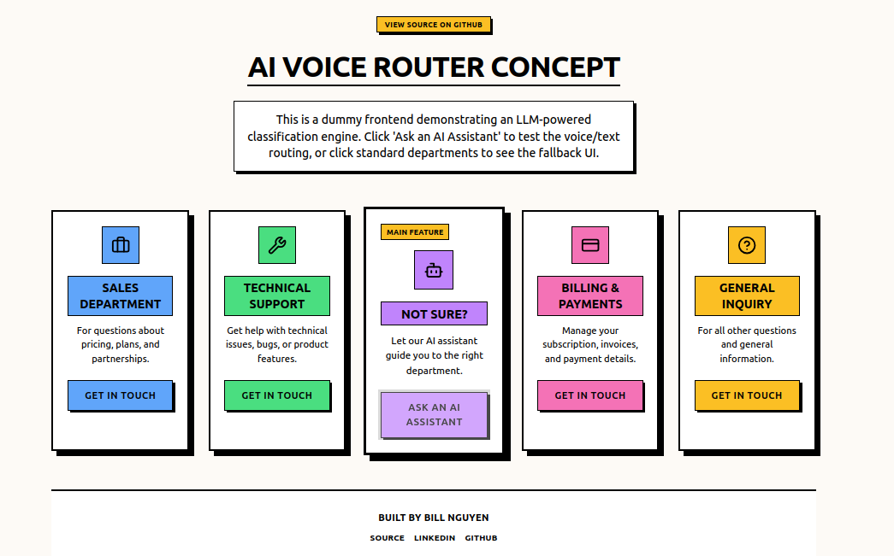

# 🎙️ VoiceRouter 

[](https://voicerouter.vercel.app) [](https://github.com/BillPotato/voiceRouter/actions/workflows/test.yml)



VoiceRouter is a front-end web app built to demonstrate LLM-powered classification. This project specifically demonstrates how it can be used in helpdesk work. It converts user voice input into text and routes the request to the appropriate department based on user intent.

**Architecture Note:** This project is a stateless proof-of-concept. All routing actions are mock fallbacks, and there is no backend database or live agent system.

## Features

* **AI Intent Routing:** Uses an LLM via OpenRouter to accurately categorize user intent from transcripts.
* **Voice-to-Text:** Implements the Web Speech API for voice input, with a text fallback for unsupported browsers.

## Tech Stack

* **Framework:** [Next.js](https://nextjs.org/)
* **Language:** [TypeScript](https://www.typescriptlang.org/)
* **Styling:** [Tailwind CSS](https://tailwindcss.com/)
* **UI Components:** [shadcn/ui](https://ui.shadcn.com/)
* **AI:** [OpenRouter API](https://openrouter.ai/)
* **Voice Input:** Web Speech API
* **Deployment:** [Vercel](https://vercel.com/)

## Local Setup

### Prerequisites
* Node.js 18.x or later
* OpenRouter API Key ([Get one here](https://openrouter.ai/))

### Installation

1.  **Clone the repository:**
    ```bash
    git clone https://github.com/BillPotato/voiceRouter.git
    cd voiceRouter
    ```

2.  **Install dependencies:**
    ```bash
    npm install
    ```

3.  **Set up Environment Variables:**
    Create a `.env.local` file in the root directory:
    ```env
    OPENROUTER_API_KEY=your_api_key_here
    ```

4.  **Run the development server:**
    ```bash
    npm run dev
    ```
    Open [http://localhost:3000](http://localhost:3000).

## License

This project is licensed under the MIT License.

## Author

**Bill Nguyen** *Student, University of South Florida* [GitHub](https://github.com/BillPotato)